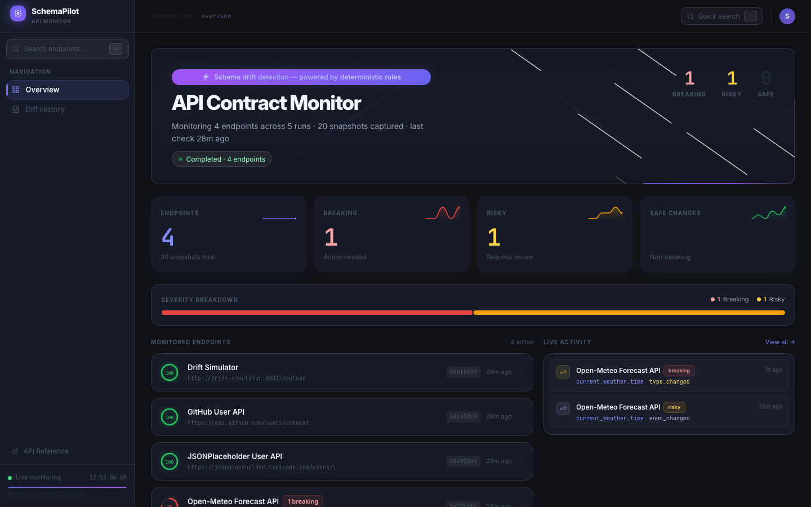
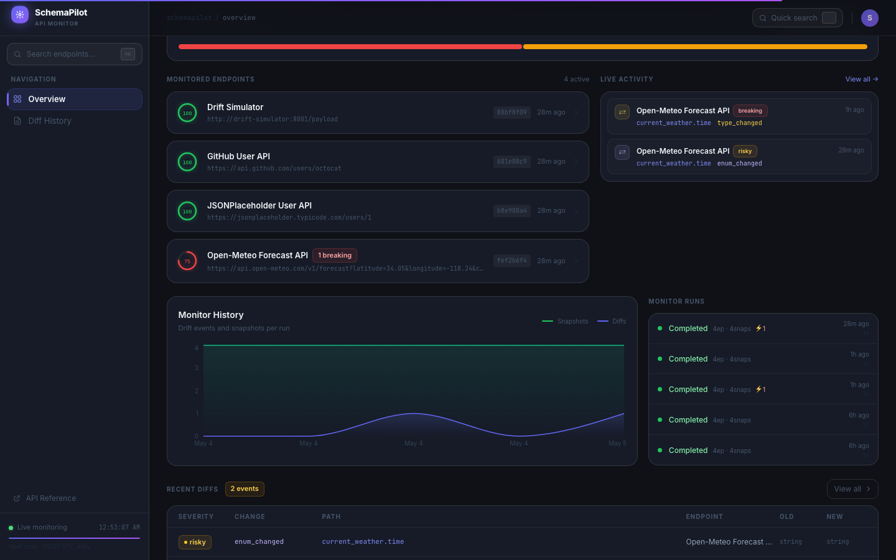
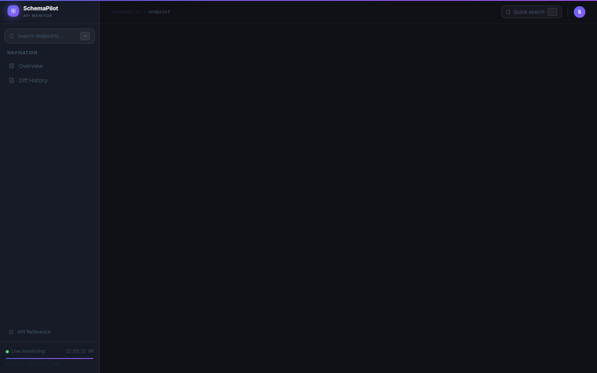
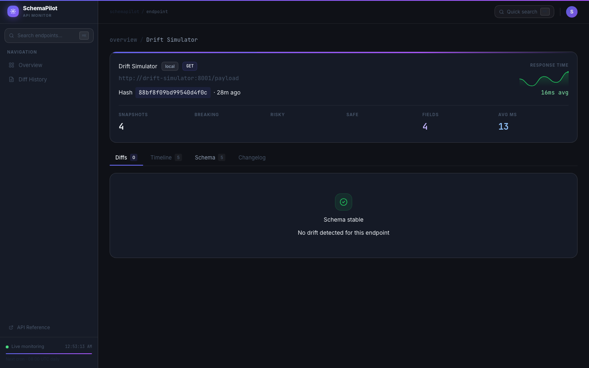
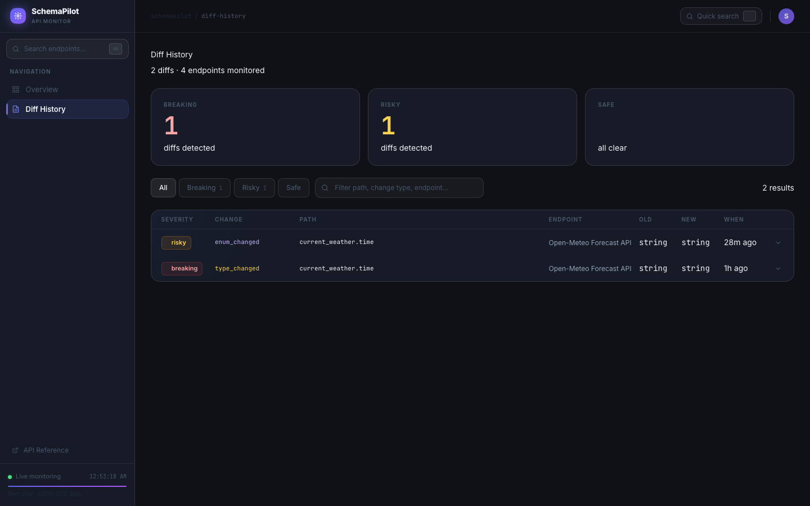
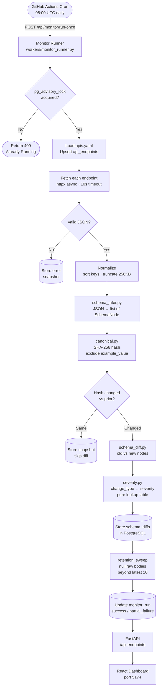
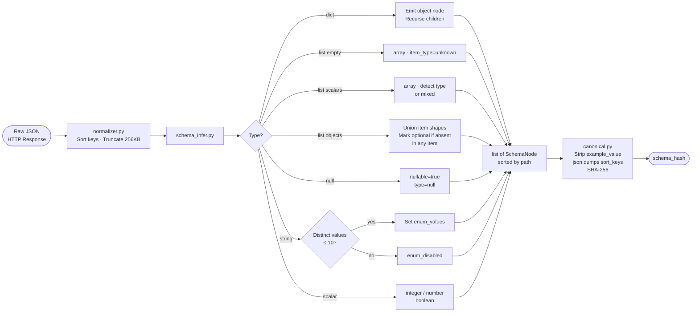
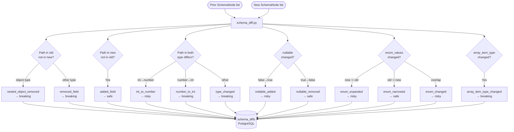
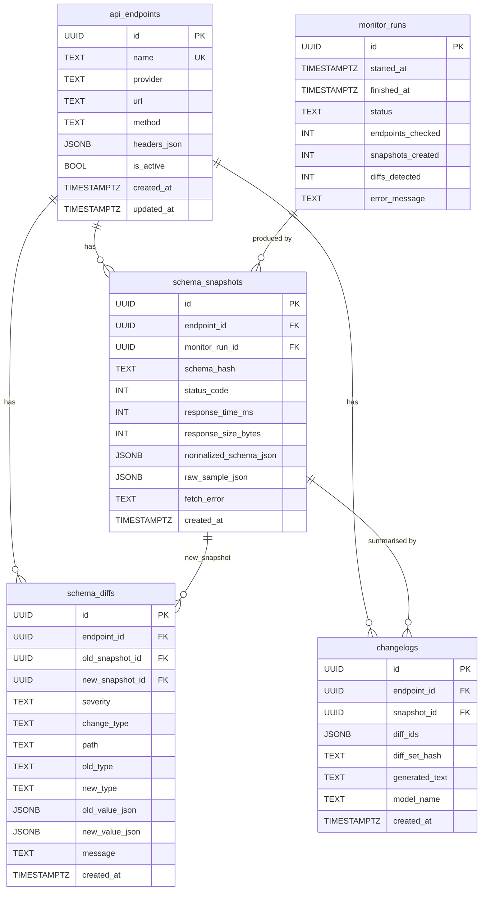
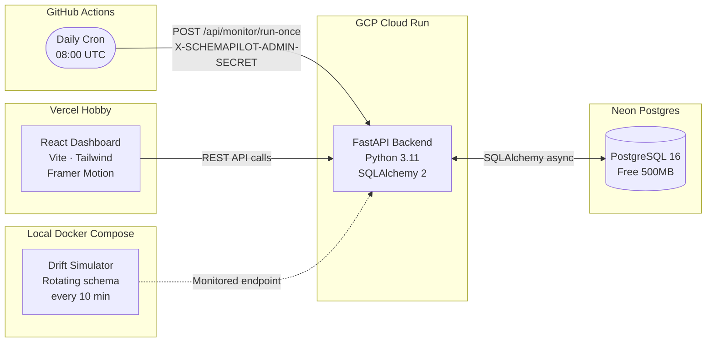

# SchemaPilot — API Contract Drift Monitor

> A production-quality developer tool that monitors live JSON APIs, infers their schemas from observed responses, and detects breaking contract drift using **fully deterministic, unit-tested rules**. The LLM layer is optional and only converts validated structured diffs into human-readable changelogs — it never decides severity.



---

## What it solves

APIs change without warning. A field gets renamed, a type widens, a reliable value suddenly becomes nullable — and your integration silently breaks in production. SchemaPilot polls your endpoints on a schedule, infers JSON schemas from live HTTP responses (no OpenAPI spec required), and immediately flags drift when the contract changes.

- **Zero schema files needed** — infers from observed responses
- **Deterministic severity** — every classification is a rule lookup, fully unit-tested
- **Field-level granularity** — knows exactly which path changed and why it breaks
- **Free to run** — Neon + Cloud Run + Vercel + GitHub Actions, all free tier

---

## Screenshots

### Dashboard Overview


### Endpoints + Monitor History


### Endpoint Detail — Diff View


### Schema Field Viewer


### Diff History


---

## Architecture & Data Flow



---

## Schema Inference Flow



---

## Diff Classification Flow



---

## Database Schema



---

## Deployment Architecture



---

## Severity Rules (Response-Runtime Semantics)

All classification is **deterministic** — pure lookup table in `core/severity.py`. The LLM never touches this.

| Change | Severity | Why |
|---|---|---|
| Field removed | **breaking** | Consumer gets KeyError / missing data |
| Field added | safe | Consumers ignore unknown fields |
| Type changed | **breaking** | Consumer logic crashes |
| Integer → Number | risky | Float where int expected |
| Number → Integer | **breaking** | Decimal consumers lose precision |
| Nullable false → true | risky | Consumers may not null-check |
| Nullable true → false | safe | Null-handling becomes dead code |
| Enum expanded (new values) | risky | Strict consumers reject new values |
| Enum narrowed (values removed) | safe | Dead code branches |
| Enum changed (overlap) | risky | Partial set changes |
| Array item type changed | **breaking** | Iteration crashes |
| Nested object removed | **breaking** | Same as field removed |

> Severity reflects **runtime impact on JSON consumers**, not formal contract violations.

---

## Tech Stack

| Layer | Technology |
|---|---|
| Backend | FastAPI 0.115 · Python 3.11 |
| ORM / Migrations | SQLAlchemy 2.0 · Alembic 1.14 |
| Validation | Pydantic v2 · pydantic-settings |
| HTTP Client | httpx (async) |
| Frontend | React 18 · TypeScript · Vite 6 · Tailwind CSS 3 |
| UI Animations | Framer Motion · MagicUI components |
| Data Fetching | TanStack Query v5 · Axios |
| Database | PostgreSQL 16 (Neon-compatible) |
| Scheduler | GitHub Actions cron |
| Deploy | Cloud Run · Vercel · Neon Postgres |

---

## Local Quickstart

```bash
# Clone and copy env
git clone https://github.com/sushildalavi/SchemaPilot-API-Contract-Drift-Monitor
cd SchemaPilot-API-Contract-Drift-Monitor
cp .env.example .env

# Start all services
docker compose up -d --build

# Trigger first monitor run
curl -X POST http://localhost:8080/api/monitor/run-once \
  -H "X-SCHEMAPILOT-ADMIN-SECRET: dev-secret"

# Open dashboard
open http://localhost:5174
```

The **Drift Simulator** service rotates its schema every 10 minutes — run the monitor again after 10+ min to see live drift detection.

### Port Map

| Service | Port |
|---|---|
| Backend API | `localhost:8080` |
| Frontend Dashboard | `localhost:5174` |
| Drift Simulator | `localhost:8001` |

---

## Project Structure

```
schemapilot/
├── backend/
│   ├── app/
│   │   ├── core/              # Pure functions: infer, diff, severity, hash
│   │   │   ├── schema_infer.py  ← JSON → list[SchemaNode]
│   │   │   ├── schema_diff.py   ← (old, new) → list[Diff]
│   │   │   ├── severity.py      ← change_type → severity (lookup only)
│   │   │   ├── canonical.py     ← stable_schema_hash (excludes examples)
│   │   │   ├── changelog.py     ← Anthropic call + template fallback
│   │   │   ├── fetcher.py       ← httpx async + error capture
│   │   │   ├── normalizer.py    ← key-sort + 256KB cap
│   │   │   ├── locking.py       ← pg_advisory_lock context manager
│   │   │   └── registry_loader.py ← apis.yaml → DB upsert
│   │   ├── api/               # FastAPI route handlers
│   │   ├── workers/           # monitor_runner.py (orchestrator)
│   │   └── tests/             # 49 pytest tests (pure functions)
│   └── alembic/               # DB migrations
├── drift-simulator/           # Rotating-schema service for demos
├── frontend/
│   └── src/
│       ├── components/        # MagicUI: BorderBeam, MagicCard, NeonGradientCard,
│       │                      #   AnimatedList, BlurFade, RetroGrid, NumberTicker,
│       │                      #   AnimatedGradientText, Meteors, Sparkline...
│       ├── pages/             # Dashboard · EndpointDetail · RecentDiffs
│       └── api/               # Typed axios client + React Query keys
├── config/
│   └── apis.yaml              # Endpoint registry
└── .github/workflows/
    ├── ci.yml                 # Backend tests + frontend build
    └── monitor.yml            # Daily cron trigger
```

---

## Production Deploy (Free Tier)

See **[DEPLOY.md](DEPLOY.md)** for the full step-by-step guide.

| Resource | Service | Free Limit |
|---|---|---|
| Database | Neon Postgres | 500 MB |
| Backend | GCP Cloud Run | 2M req/month |
| Frontend | Vercel Hobby | Unlimited |
| Cron | GitHub Actions | Unlimited (public repo) |
| LLM | Anthropic Haiku | Pay-per-use (optional) |

**Monthly cost: $0** at portfolio scale.

---

## GitHub Actions Cron

`.github/workflows/monitor.yml` fires daily at 08:00 UTC. No code checkout — pure HTTP POST to the deployed backend:

```yaml
- name: Trigger monitor
  run: |
    curl -fsSL --max-time 120 -X POST "$BACKEND_URL/api/monitor/run-once" \
      -H "X-SCHEMAPILOT-ADMIN-SECRET: $ADMIN_SECRET"
```

Manual dispatch available via Actions → "Run workflow" for immediate testing.

---

## Example Structured Diff

```json
{
  "severity": "breaking",
  "change_type": "removed_field",
  "path": "current_weather.temperature",
  "old_type": "number",
  "new_type": null,
  "message": "Field current_weather.temperature was removed from the response schema."
}
```

## Example AI Changelog

```markdown
## Breaking (1)
- `current_weather.temperature` — Field current_weather.temperature was removed
  from the response schema.

## Risky (1)
- `current_weather.time` — Field current_weather.time is now nullable
  (consumers may receive null).
```

---

## Tests

49 unit tests covering every deterministic component — all pure functions, no network, ~10s runtime.

```bash
docker compose exec backend sh -c "pip install pytest pytest-asyncio -q && pytest app/tests/ -v"
```

Test coverage:
- `test_canonical_hash.py` — hash stability, excludes example values
- `test_schema_infer.py` — objects, arrays, optionality, nullables, enums
- `test_severity_table.py` — every row in the rule table
- `test_schema_diff.py` — all 12 change types, correct severity
- `test_monitor_runner.py` — snapshot storage, diff creation, failure handling
- `test_admin_secret.py` — 401 on missing/wrong header
- `test_concurrent_runs.py` — 409 when advisory lock held

---

## Known Limitations

1. **Single-sample inference** — first omission of an optional field triggers `removed_field → breaking`. Stabilises after two snapshots.
2. **Response-side only** — no request schema monitoring.
3. **GHA cron timing** — 5-min minimum granularity, may run late.
4. **Single-instance locking** — `pg_advisory_lock` works for one backend replica.
5. **Body cap** — responses > 256 KB are truncated in storage; inference runs on full body.

---

## Future Improvements

- Multi-sample inference for better optional-field detection
- Per-endpoint polling intervals
- Slack / email alerts on breaking diffs
- OpenAPI / Swagger spec import as baseline
- Schema history pruning UI
- Multi-replica concurrency (Redis lock)
